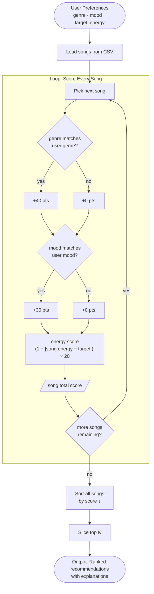

# Recommender Data Flow

```mermaid
flowchart TD
    A([User Preferences\ngenre · mood · target_energy]) --> B[Load songs from CSV]
    B --> C[Pick next song]

    subgraph LOOP [" Loop: Score Every Song "]
        C --> D{genre matches\nuser genre?}
        D -- yes --> E[+40 pts]
        D -- no  --> F[+0 pts]
        E & F --> G{mood matches\nuser mood?}
        G -- yes --> H[+30 pts]
        G -- no  --> I[+0 pts]
        H & I --> J["energy score\n(1 − |song.energy − target|) × 20"]
        J --> K[/song total score/]
        K --> L{more songs\nremaining?}
        L -- yes --> C
    end

    L -- no --> M[Sort all songs\nby score ↓]
    M --> N[Slice top K]
    N --> O([Output: Ranked recommendations\nwith explanations])
```
